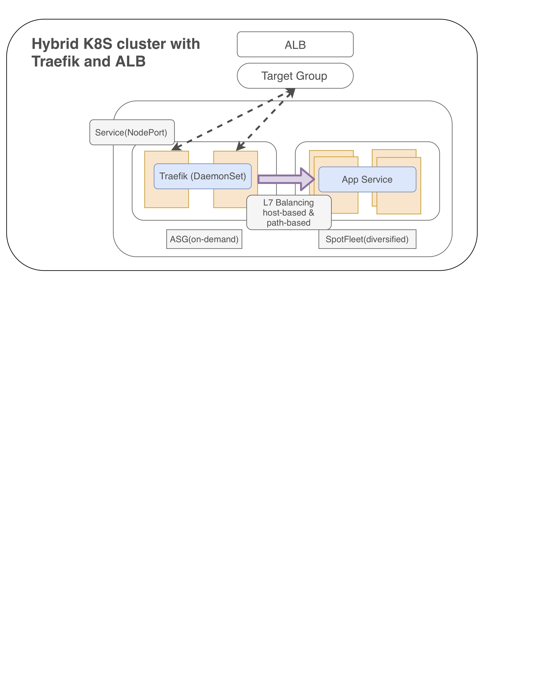

### traefik-ingress


Launch the demo Lab

```
$ cd traefik-ingress
$ kubectl apply -f .
```


Get your ELB endpoint

```
$ kubectl -n kube-system get svc/traefik-ingress-lb-svc -o jsonpath={.status.loadBalancer.ingress[*].hostname}
a91f881de463811e8aca806776b0716f-838154059.us-west-2.elb.amazonaws.com
```


check `/` for the greeting service

```
$ curl http://<YOUR_ELB_HOSTNAME>
[ERROR] please input your name in the request argument, e.g. /?name=pahud
$ curl http://<YOUR_ELB_HOSTNAME>/?name=pahud
Hello pahud
```


check `/caddy` and you should be able to see the `index.html` of [Caddy](https://caddyserver.com/).

```
$ curl http://<YOUR_ELB_HOSTNAME>/caddy
```


 check `/nginx` for nginx `index.html`

```
$ curl http://<YOUR_ELB_HOSTNAME>/nginx
```


## Traefik-ingress with ALB

This is a hybrid 8S cluster with Traefik and ALB integration with some benefits:

1. nodeGroup provisioned by **ASG(Autoscaling Group)** and **SpotFleet**
2. Nodes provisioned by ASG will have a node Label **asgnode=true**
3. ASG will register all nodes to a specific Target Group
4. Traefik running as DemonSet with nodeSelector **asgnode=true**, which means:
   1. Every node provisioned by ASG will have a Traefik running as DaemonSet because of the node label selector.
   2. Every node with Traefik running as DaemonSet and exposed as NodePort will be auto registered onto Target Group.
   3. ALB associating the Target Group and all traffic will be routed through ALB, TargetGroup, NodePort, Traefik(DaemonSet pod) and then being L7 balanced to other K8S services within the same cluster either with host-based or path-based policies defined in the Traefic ingress resource.
   4. ALB will take care the HTTPS SSL/TLS termination, hence offload the overhead.
   5. Native integration between AWS WAF and ALB .

